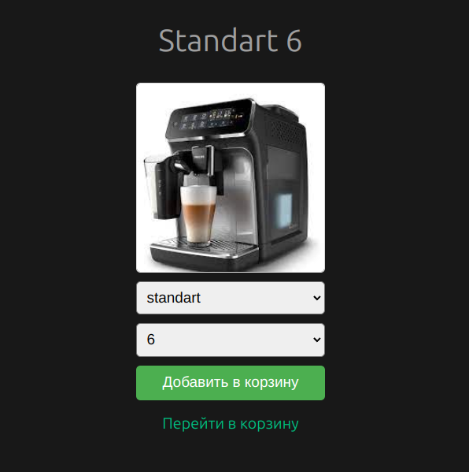
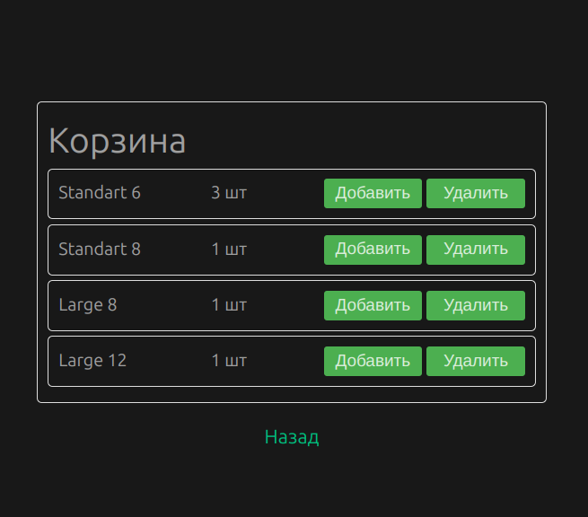

# coffe-mashine-test


<p align="center">
  
</p>

<p align="center">
  
</p>


## Команды при первом запуске

### переходим в директорию server устанавливаем зависимости и запускаем сервер !

```sh

cd server

npm install

npm run start

```

### в новом окне терминала в корне проекта устанавливаем зависимости и запускаем клиента !

```sh

npm install

npm run dev

```
